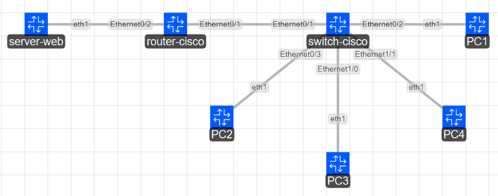

# Ejemplo de topología de red LAN con Containerlab
---

**[Run](https://codespaces.new/ernestosv73/taller-containerlab?quickstart=1) this lab in GitHub Codespaces for free**.  
[Learn more](https://containerlab.dev/manual/codespaces) about Containerlab for Codespaces.  
<small>Machine type: 2 vCPU · 8 GB RAM</small>

---
 La topología creada provee un laboratorio de pruebas para la configuración de una red LAN IPv6 que conecta un dispositivo Switch CISCO IOL-L2 y un Router CISCO IOL.
 

---
## Descripción de configuraciones
* Archivo de configuración inicial Router Cisco: config.partial
---
## Conexión a los nodos
* `docker exec -it clab-labtaller-PCx /bin/bash`
* Obtener dirección IP ejecutando: `dhcpcd eth1`
  
